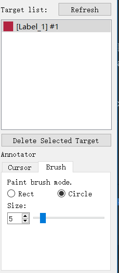

# Medical Labelme

Segmentation annotation tool for 3D medical images

[中文使用说明](readme_cn.md)

## Introduction

Medical Labelme is a annotation tool for 3D medical image.
It is a 3D version of [Labelme](https://github.com/wkentaro/labelme), 
but introducing target editing function to voxel segmentation label map.

Current version of this tool supports:
* CT/CTA image reading (only nii.gz format)
* Existing segmentation map reading (also nii.gz format)
* Common CT image control functions (zoom in/out, window level and width...)
* Voxel-wise segmentation map annotation brush
* Target list display, navigation and remove function


## Run
The project is written in python using SimpleITK and PyQt5.
It has not been uploaded to pypi.
You can use this tool by running:
```commandline
git clone https://github.com/MeteorsHub/MedicalLabelMe.git
cd src
python app.py
```
If you need to build executable programs on Windows or Mac,
you can use [pyinstaller](https://www.pyinstaller.org).

## Usage

### Medical Image Reading and Writing
File-Open: open a nii.gz format CT image or corresponding segmentation map when there has been an image loaded.
File-Save: save the current segmentation map.
FIle-Close: close current image.

### Image Information Display
The upper part of the left sidebar will show the image information.
From top to bottom:
file path to the image, file path to the segmentation map, image size, voxel value under cursor.


### Image Display Window
The center part of the software shows the image in three perspective: 
Axial (top left), Sagittal (top right) and Coronal (bottom left).
There is no graphics rendering at the bottom right currently.


### 3D Annotation
The right sidebar includes functions about annotation.


An annotation target list is shown at the top.
When reading a new image or hit the Refresh button to the top, the target list will be refreshed.
Click an item in the list, and the cursor will navigate to the center of this target.
Click the Delete Selected Target button, and the selected target will be removed from the segmentation map (set to background).

The labeling tools is shown at the bottom.
Cursor tab: voxel selection mode.
Brush tab: annotation mode.
You can use rect brush or circle brush, both of which support size adjustment.
You can also preview the brush in the image display window.

### Control
The software use the same controlling way used in [ITK-Snap](http://www.itksnap.org/).
The mouse control on image display window:

Voxel selection mode:
* Left button: cursor navigation
* Middle button: drag the image
* Right button: zoom in/out when moving up/down

Annotation mode:
* Left button: draw labels
* Middle button: drag the image
* Right button: delete labels (eraser)

Notion:
After changing the annotation map, you must click the Refresh button to refresh the target list.

