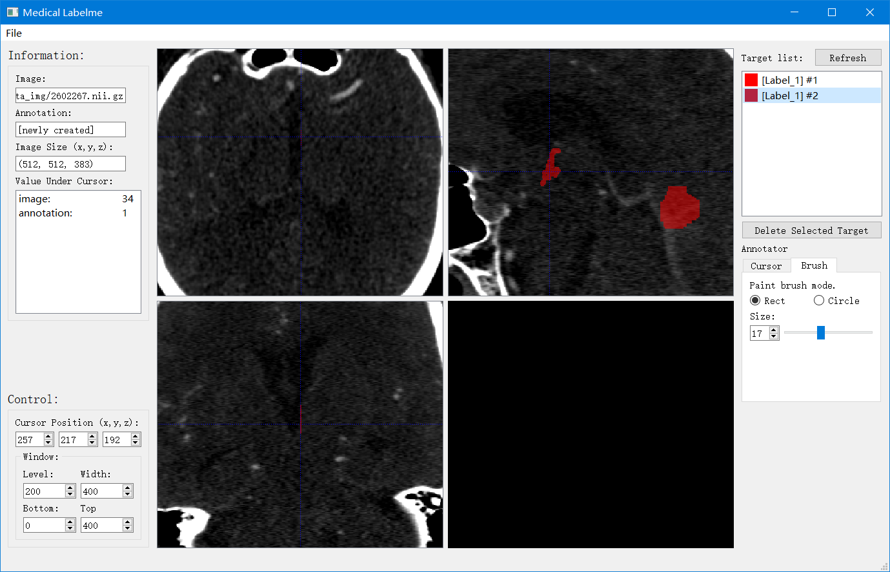
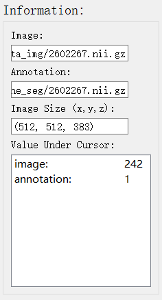
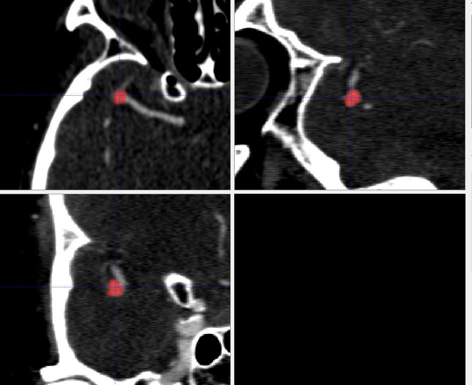

# Medical Labelme

Segmentation annotation tool for 3D medical images

## 简介

Medical Labelme是一个为3D医学图像制作和编辑分割标签图的工具。
其最大的特点是基于目标（target）而非像素（voxel）进行定位和编辑，
类似[Labelme](https://github.com/wkentaro/labelme)，
但又提供了Labelme没有的像素级分割标签图编辑功能。
当前版本的工具支持：

* CT图像（nii.gz格式）读入
* 已有分割标签图（nii.gz）格式读入
* 常见CT图像显示控制，如放大缩小、窗宽窗位调整等操作
* 像素级分割标签制作工具
* 标签目标（target）列表显示、定位和目标删除操作



## 运行

该项目暂时还未提供pypi安装包，
可以通过下载后python运行的方式：
```commandline
git clone https://github.com/MeteorsHub/MedicalLabelMe.git
cd src
python app.py
```
如果需要不同平台下的可执行程序，可以利用[pyinstaller](https://www.pyinstaller.org)工具。

## 使用

### 医疗图像读取和保存

菜单栏-文件（file）-打开（open），可以打开nii.gz类型的3D CT图像。
当程序中已有CT图像（raw image）时，可以打开对应的分割标注图像（annotation image）。
菜单栏-文件（file）-保存（save），可以保存当前的分割标签图。
菜单栏-文件（file）-关闭（close），可以关闭当前图像。

### 图像信息显示

程序左侧边栏上半部分会显示程序当前打开图片的信息，由上到下分别为
CT图像文件路径、分割标签图文件路径、图像大小、当前选择的像素点CT值和标签值



### 三视图界面

程序中间部分显示当前打开的图像的三视图，左上为横断面（A），右上为矢状面（S），左下为冠状面（C）。
右下暂时没有图像展示。



### 分割标签图

程序右侧边栏包含分割标注相关的功能。


上面是一个分割标签目标（target）列表。
每当读取一张分割标签图时和点击刷新（refresh）按钮后，列表中就会显示当前标签图中的所有目标。
选中一个目标后，三视图会跳转到对应的目标中心位置。
点击删除当前目标（delete selected target）后，该标签目标将会删除（在标签图中置为背景）。

下面是标签图绘制操作选项。
选择指针（cursor）选项卡，即为“像素选择模式”；
选择画笔（brush）选项卡，即为“标签绘制模式”，可以在三视图中进行标签绘制。
标签绘制模式支持方形（rect）画笔和圆形（circle）画笔，两者均可以调节画笔粗细（size）。
选择后三视图中可以显示相应大小和形状的画笔预览。

### 操作控制

程序的操作方式同[ITK-Snap](http://www.itksnap.org/)类似，
在三视图界面上的鼠标操作逻辑为：

像素选择模式：
* 鼠标左键：光标定位
* 鼠标中键：拖动画布
* 鼠标右键：上下拖动放大缩小视图

标签绘制模式：
* 鼠标左键：绘制前景标签（画笔）
* 鼠标中键：拖动画布
* 鼠标右键：删除前景标签（橡皮擦）

注意：调整标签图后，必须点击右上侧的刷新（refresh）按钮，目标列表中的目标才会刷新。

程序左侧边栏下边提供了当前像素的精确选择以及窗宽窗位调整的功能。
